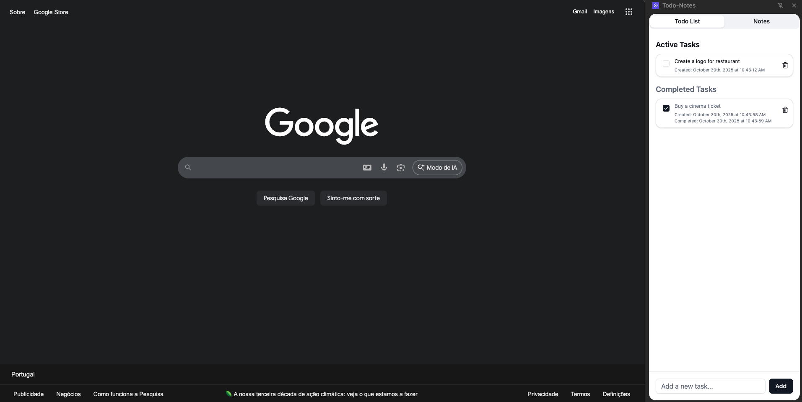
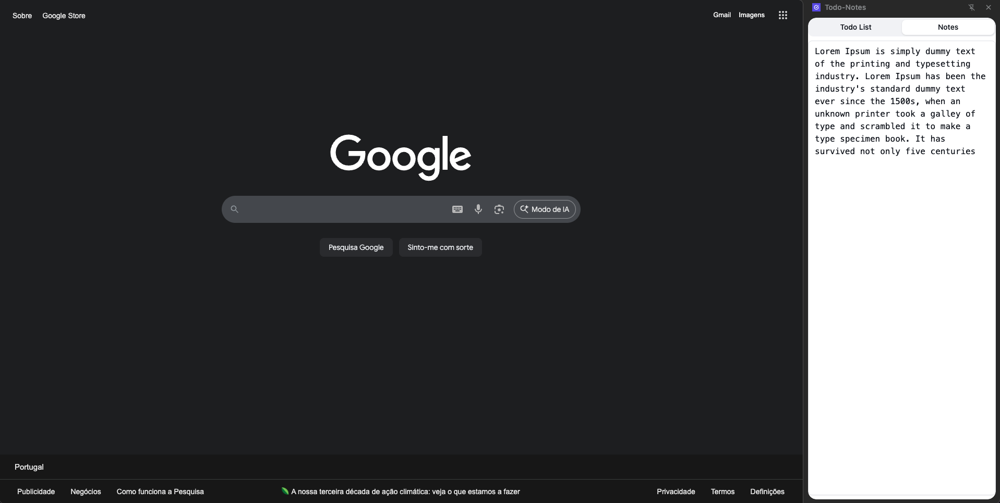

# Todo-Notes Chrome Extension

A Chrome extension built with React, TypeScript, and Vite that provides a side panel for managing todos and notes.

## Screenshots

### Todo List



### Notes



## Installation

To install this extension locally in Chrome:

1. **Build the extension**

   ```bash
   pnpm install
   pnpm build
   ```

2. **Load the extension in Chrome**

   - Open Chrome and navigate to `chrome://extensions/`
   - Enable "Developer mode" (toggle in the top-right corner)
   - Click "Load unpacked"
   - Select the `dist` folder from this project

3. **Access the extension**
   - Click the extension icon in your Chrome toolbar
   - Or use `Ctrl+Shift+S` (Windows/Linux) or `Cmd+Shift+S` (Mac) to open the side panel
